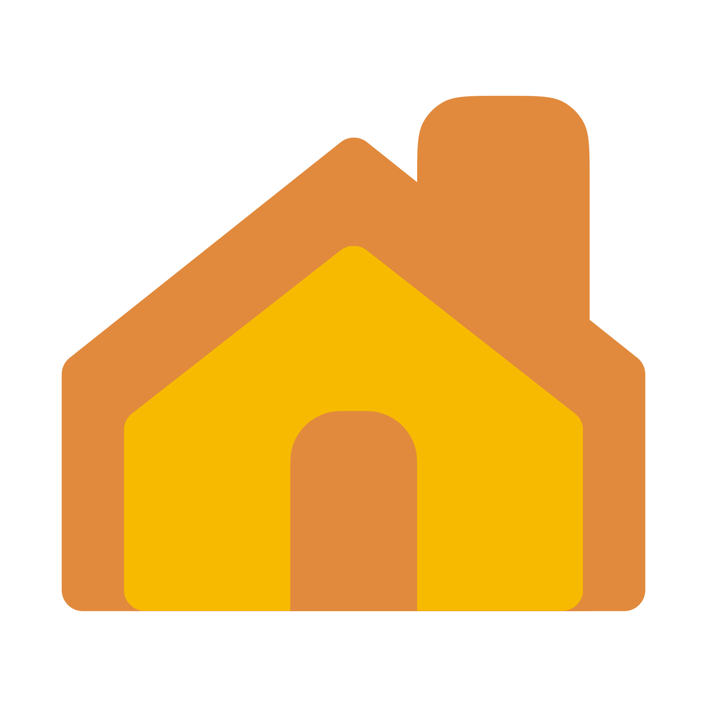

  <a href="https://github.com/brandonkthomas/HomePlus">
    <picture>
      <source media="(prefers-color-scheme: dark)" srcset="Public/AppIcon/AppIcon-iOS-Dark-256@2x.png">
      <source media="(prefers-color-scheme: light)" srcset="Public/AppIcon/AppIcon-iOS-Default-256@2x.png">
      
    </picture>
  </a>

  

    Simple iOS HomeKit controller application.
     
    Unfinished concept / first Swift project. No further updates are planned at this time.
     
     
    
  

